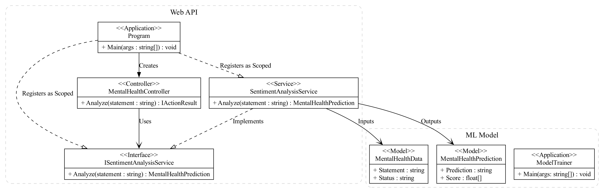
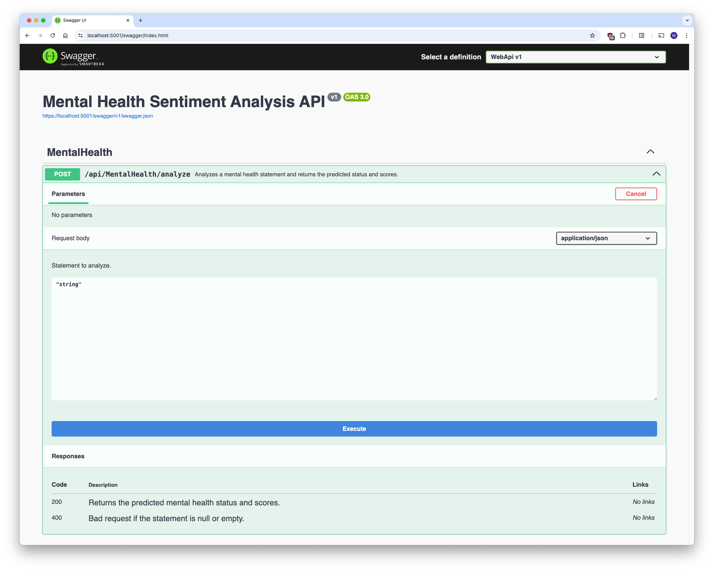

# Mental Health Sentiment Analysis API

## Overview
The Mental Health Sentiment Analysis API is a RESTful API built with ASP.NET Core that classifies user-submitted statements into mental health categories (e.g. Normal, Anxiety, Depression, Stress, Suicidal, etc.). It uses ML.NET to process [mental health data](https://www.kaggle.com/datasets/suchintikasarkar/sentiment-analysis-for-mental-health) and train a multiclass classification model on the data. The API accepts a raw text statement via HTTP and returns the predicted mental health status.

I developed this to demonstrate end-to-end ML model training and deployment using C#, ML.NET and ASP.NET Core. This tool is for demo purposes only and should not be used for real world mental health assessments.

## Features

- **Text Cleaning:** Custom mapping removes URLs, HTML tags, punctuation, digits, bracketed text, and normalizes to lowercase.
- **TF-IDF Featurization:** Tokenizes, removes stop-words, maps tokens to keys, then produces TF-IDF weighted n-grams.
- **Hyperparameter Sweep:** Search over varying L2 regularization strengths with 5-fold cross-validation to find the best multiclass classifier.
- **ML Model:** Trains and saves the classifier using ML.NET, which is loaded by the RESTful API developed in ASP.NET Core.
- **Swagger Integration:** Provides comprehensive API documentation and testing capabilities.

## Prerequisites

- .NET 8.0
- A self-signed certificate to enable HTTPS (optional if using HTTP).
- An API client or Swagger UI (included with the project).

## Model Performance

I performed hyperparameter tuning over SDCA, LBFGS, OVA + SDCA and OVA + LBFGS across varying L2-regularization strengths. The best cross-validated model was LBFGS with no L2 regularization.

| Best Algorithm | **LBFGS (Maximum Entropy)** |
| -------------- | --------------------------- |
| Hyperparameters | *No L2 Regularisation* |

| Metric | 5-fold CV | Test Set |
| ------ | --------- | -------- |
| Micro Accuracy | **0.7601** | **0.7580** |
| Macro Accuracy | **0.7087** | **0.7059** |
| Log Loss | **1.0966** | **1.1200** |

### Summary
* **Micro Accuracy** (overall): 75.8% of all statements are classified correctly.

* **Macro Accuracy** (per-class average): 70.6% macro accuracy means the model's per-class performance nearly matches its overall score, so minority classes are not neglected.

* **Log Loss**: A log loss of 1.12 is reasonably low for a 7-class problem. It indicates the model is reasonably confident in its predictions.

* **Model Generalization**: The very small gap between cross-validated and test set scores shows the model generalizes well and is not over-fitting.

## Setup and Running the API

Build and Run the Project

```bash
cd WebApi
dotnet build
dotnet run
```

The server will be hosted at `https://localhost:5001` (or `http://localhost:5000`). You can test the API using tools like Postman or Swagger UI.

## API Usage and Documentation

Once the API is running, you can access the Swagger UI at:

```
https://localhost:5001/swagger
http://localhost:5000/swagger
```

## Architecture

<div align="center">
  
</div>

## Swagger UI

<div align="center">
  
</div>
